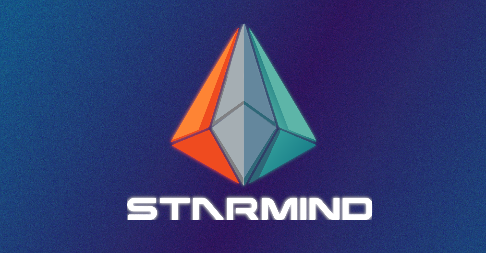
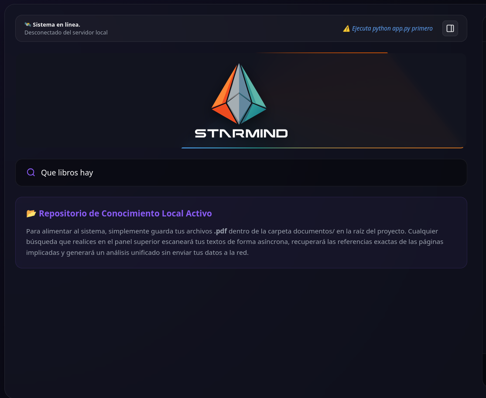
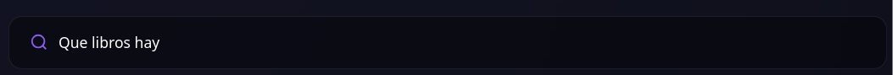
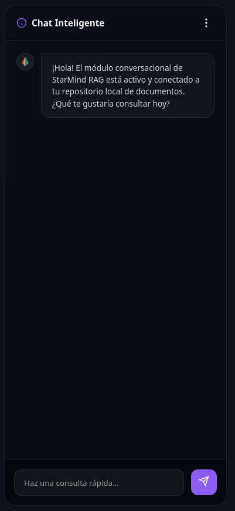

<p align="center">
    
</p>

<h1 align="center">🚀 StarMind RAG</h1>

<p align="center">
<b>Retrieval-Augmented Generation Platform</b><br>
Semantic Search • Local Knowledge Base • Conversational AI
</p>

<p align="center">


</p>

---

# 🌌 About

**StarMind RAG** is a modern Retrieval-Augmented Generation platform designed to transform collections of documents into an intelligent semantic knowledge base.

Instead of relying on keyword matching, StarMind retrieves the most relevant document fragments using vector similarity before generating accurate, context-aware responses with an AI language model.

Everything is designed around a **local-first** philosophy, giving you complete control over your data.

---

# ✨ Features

- 🧠 Semantic document retrieval
- 📚 Vector database powered by ChromaDB
- 💬 AI conversational assistant
- 📄 PDF knowledge indexing
- 🔍 Context-aware semantic search
- ⚡ FastAPI backend
- 🎨 Cyberpunk Glassmorphism Interface
- 🌐 Optional Hybrid Web Search
- 🔒 Privacy-first architecture

---

# 🎥 Live Demo

Click below to watch StarMind in action.

<p align="center">

<a href="assets/demo.gif">


</a>

</p>

---

# 📸 Screenshots

## Dashboard

<p align="center">

</p>

---

## Semantic Search

<p align="center">

</p>

---

## Conversational Assistant

<p align="center">

</p>

---

# 🏗 Architecture

```text
                        User
                          │
                          ▼
                  FastAPI Backend
                          │
          ┌───────────────┼────────────────┐
          ▼                                ▼
     ChromaDB                       Optional Web Search
          │                                │
          └───────────────┬────────────────┘
                          ▼
                  Context Builder
                          │
                          ▼
                 Large Language Model
                   (Groq / Ollama)
                          │
                          ▼
                   AI Generated Answer
```

---

# 🧠 Retrieval Pipeline

```text
Documents

↓

Chunking

↓

Embeddings

↓

Vector Database

↓

User Question

↓

Semantic Retrieval

↓

Top Relevant Chunks

↓

Language Model

↓

Answer + Sources
```

---

# 🛠 Tech Stack

### Backend

- Python
- FastAPI
- Uvicorn

### AI

- ChromaDB
- SentenceTransformers
- Groq API
- Ollama (optional)

### Frontend

- HTML5
- CSS3
- JavaScript
- Marked.js

---

# 📂 Project Structure

```text
StarMind-RAG/

├── assets/
│   ├── cover_starmind.png
│   ├── demo.mp4
│   └── screenshots/
│       ├── dashboard.png
│       ├── search.png
│       └── chat.png
│
├── documentos/
│   ├── *.pdf
│
├── chroma_db/
│
├── app.py
├── index.html
├── requirements.txt
└── README.md
```

---

# 🚀 Installation

Clone the repository.

```bash
git clone https://github.com/ziffythealien-blip/StarMind-RAG.git

cd StarMind-RAG
```

Install dependencies.

```bash
pip install -r requirements.txt
```

---

# 📚 Build Your Knowledge Base

Place your PDF documents inside:

```text
documentos/
```

Then start the application.

```bash
python app.py
```

StarMind will automatically index your documents into ChromaDB and make them available for semantic retrieval.

---

# 🌐 API Endpoints

## System Status

```http
GET /api/system-status
```

Returns dashboard information and live status.

---

## Semantic Search

```http
POST /api/search
```

Retrieves relevant document chunks and generates an AI-powered response.

---

## Chat

```http
POST /api/chat
```

Maintains contextual conversations with the AI assistant.

---

# 🔒 Privacy

StarMind follows a **local-first architecture**.

- Documents stay on your machine.
- Local vector database.
- No cloud storage required.
- Optional online language models.

---

# 📈 Roadmap

- ✅ PDF Retrieval
- ✅ Conversational AI
- ✅ ChromaDB
- 🔄 DOCX Support
- 🔄 Markdown Support
- 🔄 OCR Images
- 🔄 Audio Transcription
- 🔄 Video Indexing
- 🔄 Hybrid Retrieval
- 🔄 Knowledge Graph
- 🔄 Streaming Responses

---

# 🤝 Contributing

Contributions, ideas, feature requests, and pull requests are always welcome.

---

# 📄 License

This project is licensed under the **MIT License**.

---

<p align="center">

## ⭐ StarMind

### *Think Beyond Search.*

### *Retrieve Knowledge.*

### *Generate Intelligence.*

</p>
